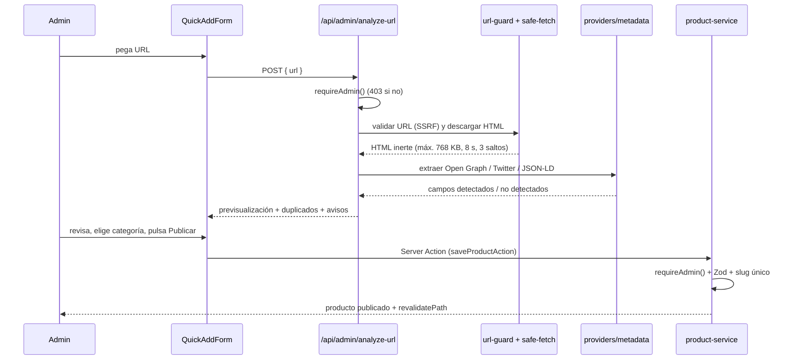

# Arquitectura

## Objetivo

Publicar fichas de producto de afiliación en el menor tiempo posible, sin
inventar datos, sin coste de infraestructura y sin convertirse en una tienda.
Todo lo demás está subordinado a eso.

## Mapa de carpetas

```
src/
  app/                  Rutas (App Router)
    (public)/           Sitio público: portada, catálogo, ficha, legales
    admin/              Login + panel (grupo (panel) protegido)
    api/                Route handlers (analyze-url, events/outbound)
    go/[offerId]/       Redirección de seguimiento (modo A)
    sitemap.ts robots.ts
  components/
    ui/                 Primitivas sin lógica de negocio
    public/             Composición del sitio público
    admin/              Composición del panel
  domain/               Lógica pura: slug, dinero, descuento, URL, view models
  security/             url-guard (SSRF) y safe-fetch (HTTP endurecido)
  providers/metadata/   Extractores de metadatos + saneado
  validation/           Esquemas Zod (frontera de entrada)
  repositories/         Acceso a datos (Supabase) → view models
  services/             Casos de uso que orquestan repositorios
  lib/                  env, logger, clientes Supabase, auth, helpers
  analytics/            Cliente de seguimiento de clics
  config/               Allow-list de hosts de imagen
  types/                Tipos de las filas de la base de datos
supabase/
  migrations/           Esquema, RLS, funciones, catálogo
  seed.sql              Categorías, proveedores y ajustes iniciales
tests/                  Tests unitarios (Vitest)
```

## Flujo de dependencias

```
app/ ──► services/ ──► repositories/ ──► Supabase
 │           │
 │           └──► providers/metadata ──► security/safe-fetch ──► security/url-guard
 │
 └──► domain/  (puro, sin dependencias de framework ni de red)
```

La regla es unidireccional: `domain/` no importa nada de `app/`, `repositories/`
no importa componentes, y ningún componente habla directamente con Supabase.

## El flujo "pegar enlace → publicar"



## Decisiones de diseño

1. **`expired` es un estado de la oferta, no del producto.** `products.status`
   es `draft | published | hidden | archived`; una oferta caducada no oculta el
   producto, sólo deja de mostrar precio.
2. **No existe una tabla `affiliate_links`.** En el MVP cada oferta tiene su
   `affiliate_url`; una tabla aparte sólo añadiría un JOIN sin aportar nada.
3. **No se usa `SUPABASE_SERVICE_ROLE_KEY`.** Todo pasa por RLS. El registro
   anónimo de clics es posible gracias a una política `WITH CHECK` que exige
   `offer_is_public(offer_id)`: el visitante sólo puede insertar un evento para
   una oferta realmente publicada, y no puede leer la tabla.
4. **Las lecturas públicas usan un cliente sin cookies** (`supabasePublic`), lo
   que permite que las páginas se cacheen estáticamente y se revaliden por ISR.
5. **`list_catalog_products` es una función `SECURITY DEFINER`** que devuelve
   los IDs de producto y el total en una sola llamada. Evita el N+1 y permite
   ordenar por precio de la oferta activa más barata, algo que PostgREST no
   puede expresar.
6. **No hay transacciones multi-tabla** (PostgREST no las expone). Al crear un
   producto, si falla la inserción de la oferta o de las imágenes se borra la
   fila del producto como compensación, dejando la base coherente.
7. **El dinero se guarda como `numeric(12,2)`.** PostgREST lo serializa como
   *string*; la conversión ocurre una sola vez en `domain/money.ts`. Nunca se
   usa un `float` para representar dinero en la base de datos.
   `offers.discount_percentage` es una columna generada (`floor`), y el cálculo
   en TypeScript replica exactamente esa fórmula.
8. **El optimizador de imágenes de Next sólo se usa con hosts de la allow-list**
   (`isOptimizableImageHost`). Cualquier otro host se muestra con un ``
   nativo y `referrerPolicy="no-referrer"`, para que `/_next/image` no pueda
   convertirse en un proxy abierto.
9. **`/go/[offerId]` resuelve el destino en la base de datos**, nunca desde un
   parámetro de la URL, y lo vuelve a validar con `isPublicHttpUrl`. Así no
   puede convertirse en un *open redirect*.
10. **`/api/events/outbound` exige mismo origen** mediante la cabecera `Origin`
    (se permite su ausencia porque `sendBeacon` no siempre la envía).
11. **Sin credenciales de Supabase la aplicación no revienta**: las lecturas
    devuelven vacío y `next build` funciona igual. Las escrituras sí fallan de
    forma explícita (`assertSupabaseConfigured`).
12. **Server Components por defecto.** Sólo son cliente los componentes que
    necesitan estado o eventos: formularios con `useActionState`, la galería, la
    navegación activa y los toasts.

## Modelo de datos (resumen)

| Tabla | Propósito |
| --- | --- |
| `profiles` | Perfil y rol (`admin`/`editor`) enlazado a `auth.users` |
| `categories` | Categorías del catálogo (slug, SEO, orden) |
| `providers` | Tiendas/anunciantes, sus dominios y si permiten redirección |
| `products` | Ficha: título, slug, descripciones, estado, destacado |
| `product_images` | Imágenes ordenadas por `position` |
| `offers` | Precio, moneda, cupón, ventana temporal, URL de afiliado, estado |
| `outbound_events` | Un registro por clic saliente (sin datos personales) |
| `settings` | Configuración clave/valor editable desde el panel |

## Caché y revalidación

| Ruta | Estrategia |
| --- | --- |
| `/`, `/categoria/[slug]`, `/producto/[slug]` | ISR, `revalidate = 300` |
| `/sitemap.xml` | ISR, `revalidate = 3600` |
| `/productos`, `/ofertas`, `/buscar` | Dinámicas (dependen de los filtros) |
| `/admin/**` | `force-dynamic`, sin caché |
| `/go/[offerId]` | `force-dynamic` + `Cache-Control: no-store` |

Las Server Actions llaman a `revalidatePath` sobre las rutas afectadas, de modo
que un cambio en el panel se ve en el sitio público sin esperar al ISR.

## Extensibilidad

Añadir una fuente de metadatos nueva (una API oficial, un feed de producto, un
CSV) consiste en implementar `MetadataProvider` y registrarla en
`providers/metadata/registry.ts`. No hay que tocar el formulario de alta, ni la
validación, ni la base de datos.
